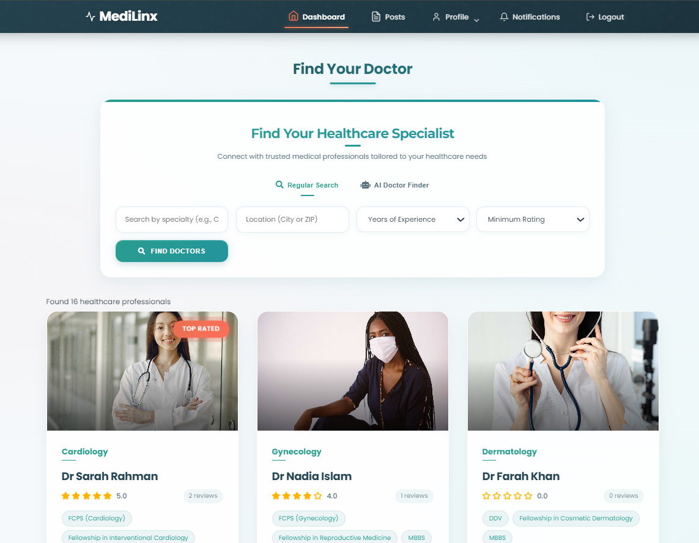
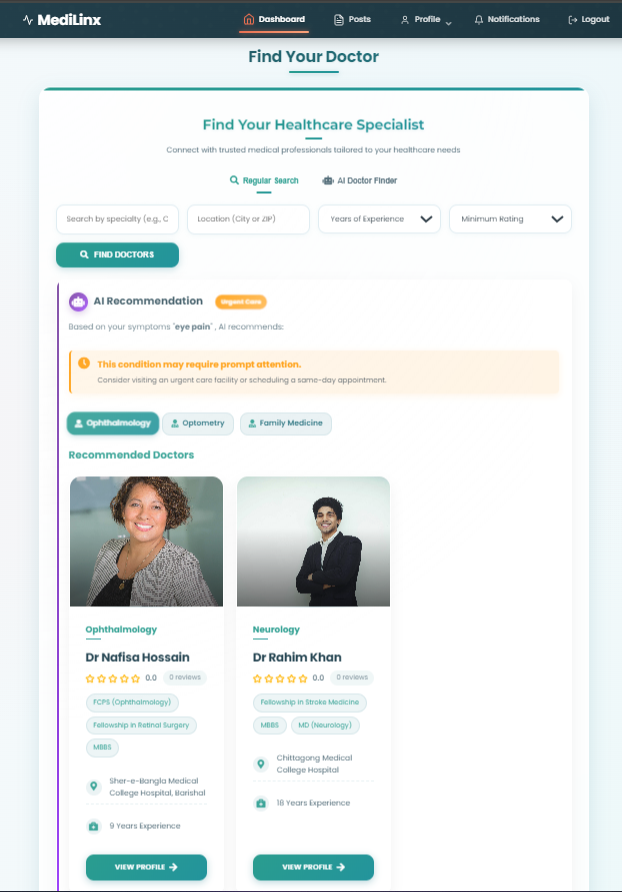
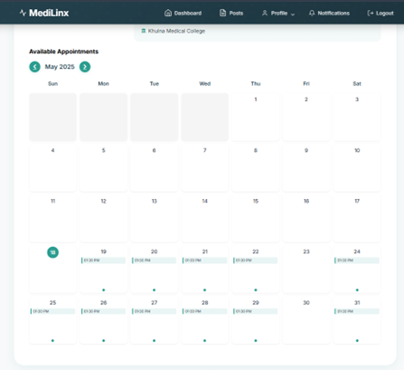
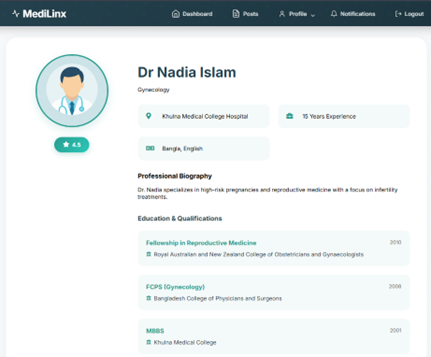
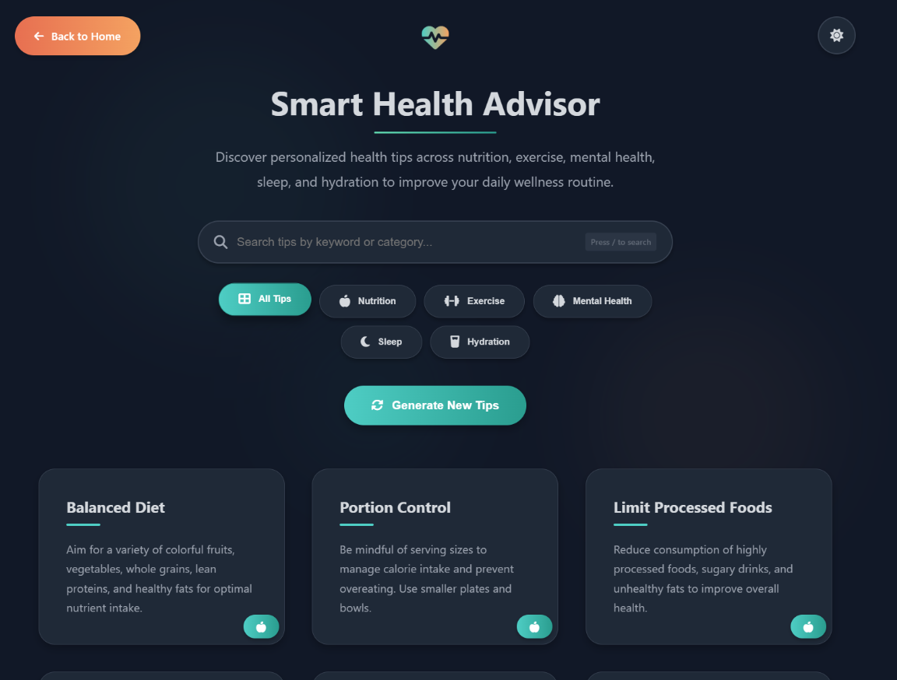

# MediLinx: Healthcare Management System

<div align="center">
  
  <br>
  <p><i>Connecting Patients and Doctors Seamlessly</i></p>
</div>

## Overview

MediLinx is a comprehensive healthcare management system developed as a 6th semester software development project. The system connects patients with healthcare providers, simplifies appointment scheduling, and provides personalized health information through an intuitive web interface.

Built with PHP and MySQL, MediLinx implements modern security practices and features an AI-powered recommendation system to match patients with suitable doctors based on their symptoms and medical needs.

## Key Features

### For Patients

- **Intelligent Doctor Search** - Find suitable doctors using AI-powered recommendations based on symptoms
- **Multi-language Symptom Input** - Enter symptoms in any language for accurate doctor matching
- **Appointment Management** - Schedule, view, and cancel appointments through an interactive calendar interface
- **Smart Health Advisor** - Access personalized health tips across nutrition, exercise, mental health, sleep, and hydration
- **Notification System** - Receive real-time updates on appointment status changes

### For Doctors

- **Profile Management** - Showcase qualifications, specialties, and professional experience
- **Time Slot Management** - Set up available consultation hours with flexible scheduling options
- **Appointment Calendar** - View and manage patient appointments with detailed information
- **Health Content Creation** - Share medical knowledge through posts visible to patients
- **Patient Management** - Access patient information and medical history for better care

### System Features

- **Secure Authentication** - Role-based access control with password protection
- **Interactive Dashboard** - User-friendly interface tailored to each user role
- **Modern UI/UX** - Responsive design with animations and intuitive navigation
- **Real-time Notifications** - Keep users informed about important updates
- **Comprehensive Database** - Well-structured data model with appropriate relationships

## Technology Stack

- **Backend**: PHP 8.2
- **Database**: MySQL (MariaDB 10.4)
- **Frontend**: HTML5, CSS3, JavaScript
- **External APIs**: Gemini AI for health tips generation
- **Security**: CSRF protection, secure sessions, input validation

## System Architecture

MediLinx follows a traditional PHP web application architecture with the following components:

1. **Authentication System** - Handles user registration, login, and session management
2. **Patient Portal** - Interface for patients to search doctors, book appointments, and view health information
3. **Doctor Portal** - Interface for doctors to manage time slots, appointments, and create health content
4. **Admin Panel** - Tools for system administration and oversight
5. **Notification Service** - Real-time notification delivery to relevant users
6. **Database Layer** - Structured data storage with appropriate relationships

### Database Schema

The database consists of multiple interconnected tables including:

- `users` - Stores user accounts with role-based information
- `appointments` - Tracks scheduled meetings between doctors and patients
- `time_slots` - Manages doctor availability for appointments
- `degrees` - Stores doctor qualifications and credentials
- `notifications` - Handles system messages to users
- `posts` - Contains health content created by doctors
- `reviews` - Stores patient feedback on doctor consultations

## Screenshots

### Landing Page


### Patient Dashboard



### Doctor Search



### Appointment Booking



### Doctor Profile



### Health Tips



## Security Implementations

MediLinx incorporates several security measures:

- **CSRF Protection** - Token validation to prevent cross-site request forgery
- **Secure Session Management** - Protected session handling to prevent hijacking
- **Password Hashing** - Secure storage of user credentials
- **Input Sanitization** - Protection against SQL injection and XSS attacks
- **Transaction-based Operations** - Ensures data integrity for critical operations

## Installation

1. Clone the repository

```bash
git clone https://github.com/yourusername/medilinx.git
```

2. Import the database

```bash
mysql -u username -p database_name < medilinx.sql
```

3. Configure database connection

   - Edit `config.php` with your database credentials

4. Set up a web server (Apache/Nginx) with PHP support

   - Ensure PHP 8.2+ is installed with required extensions

5. Access the application
   - Navigate to the URL where you've hosted the application

## Future Enhancements

- Telemedicine integration for virtual consultations
- Electronic health records (EHR) implementation
- Mobile application development
- Advanced analytics for healthcare providers
- Integration with wearable health devices

## Contributors

- [Developer Name 1](https://github.com/username1) - Backend Development
- [Developer Name 2](https://github.com/username2) - Frontend Design
- [Developer Name 3](https://github.com/username3) - Database Architecture
- [Developer Name 4](https://github.com/username4) - AI Implementation

## License

This project is licensed under the MIT License - see the [LICENSE](LICENSE) file for details.
